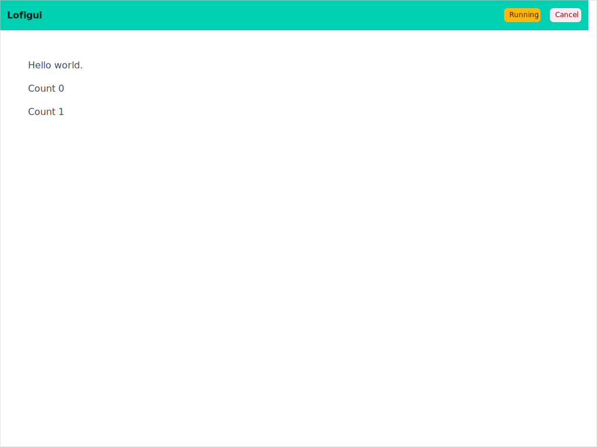
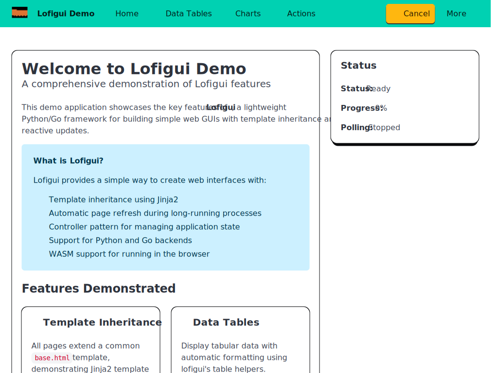
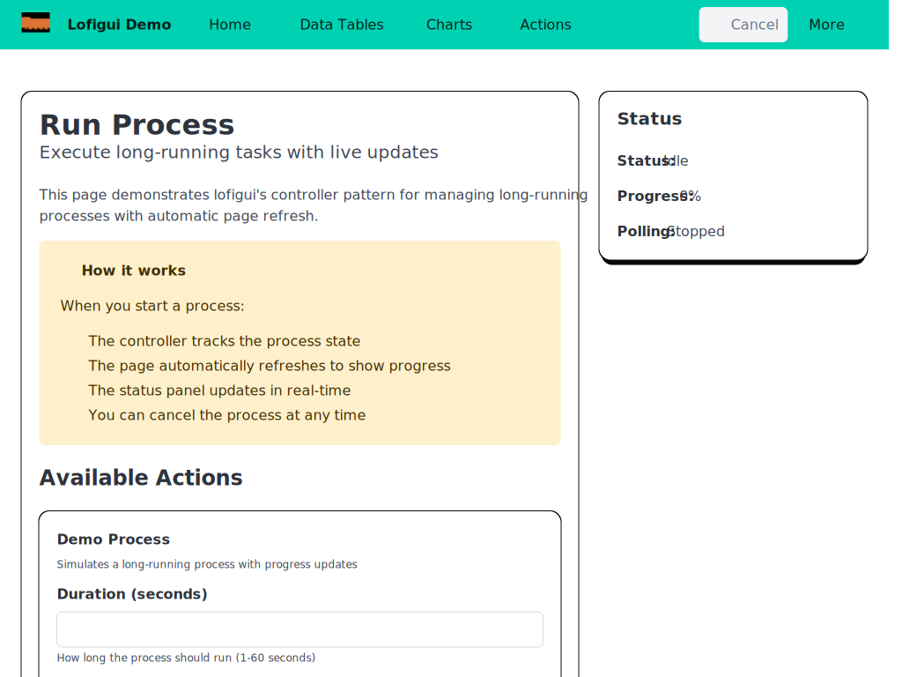
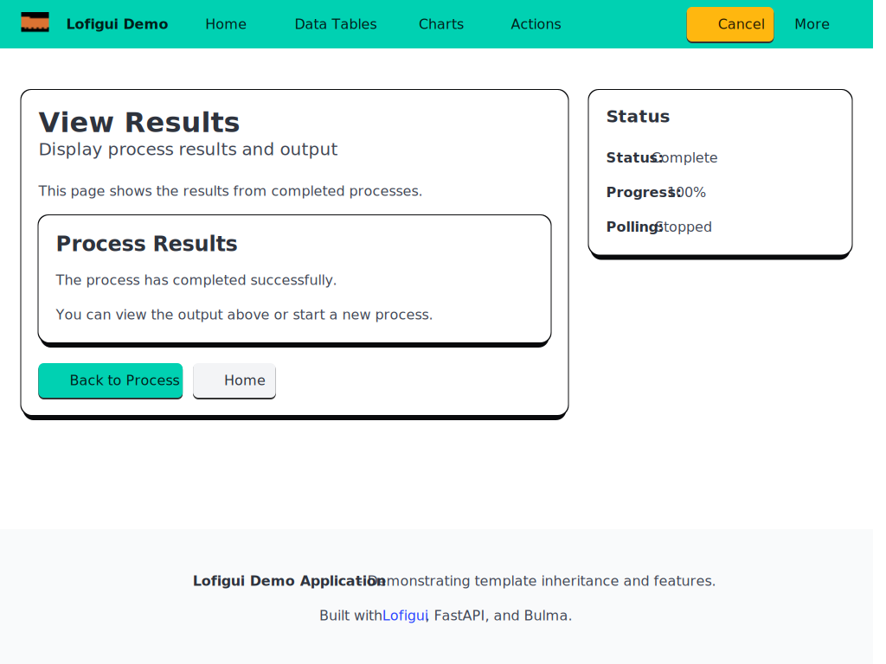
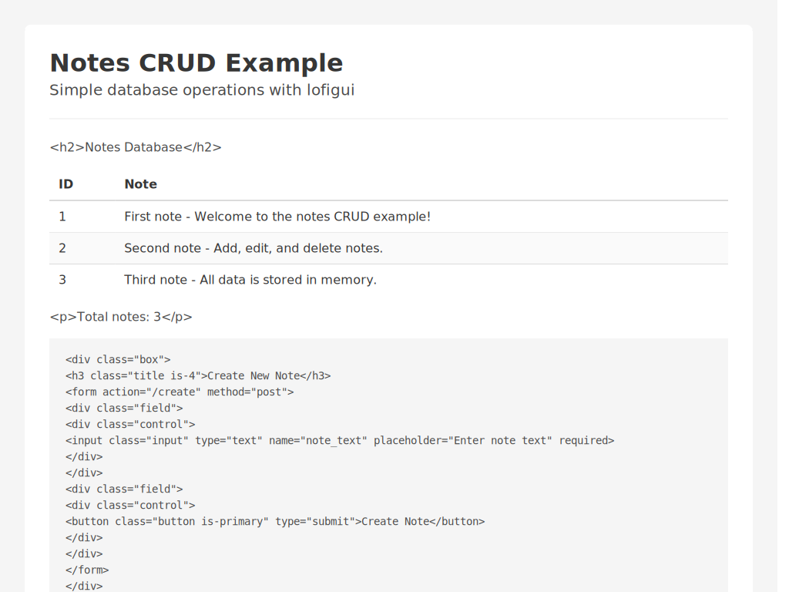

# UI Patterns

Visual guide to lofigui's UI patterns, captured from the working examples.

## 1. Basic Layout

The simplest pattern: call `Print()`, `Markdown()`, etc. to fill a buffer, then render it into a template via `{{ results | safe }}`.

**Example 01 - Completed output:**

The model prints text line by line. After `EndAction()`, the page shows the full output with no further refresh.

**Example 02 - Chart render:**

A synchronous model generates a chart inline. `HTML()` embeds the raw SVG directly into the buffer.

## 2. Polling Pattern

For long-running tasks, lofigui uses an HTTP `Refresh` header. The cycle:

1. `GET /` resets the buffer, starts the model in a goroutine, redirects to `/display`
2. `/display` renders the template; `HandleDisplay` sets the `Refresh: N` header while polling is active
3. Each reload shows the buffer's current state (partial output)
4. When the model calls `EndAction()`, the Refresh header is omitted and polling stops

**During polling (partial output):**

Only "Hello world." and "Count 0" are visible; the page will auto-refresh in 1 second.

**After completion:**

All counts rendered, "Restart" link available, no more auto-refresh.

## 3. Navigation

Example 05 demonstrates a full Bulma navbar with dropdown menus and page routing.

Each route (`/`, `/data`, `/charts`, `/process`, `/about`) renders a different page using template inheritance from `base.html`. The navbar is defined once in the base template.

## 4. Process Management

Example 05's process page shows the idle/running/complete lifecycle.

**Idle state - ready to start:**

A form with duration input and "Start Process" button. Status indicator shows "Idle".

**Running state - during polling:**

The display page shows partial output from the background process. Auto-refresh meta tag is active. A "Stop" button allows cancellation.

## 5. Completed Results

**Display after completion:**

Full output rendered, no more refresh. Navigation remains accessible to start another process or visit other pages.

## 6. CRUD Forms

Example 06 shows form-based interaction without polling. Each action (Create, Read, Update, Delete) is a form POST that modifies state and redirects back to `GET /`.

Key elements:
- **Data table** generated by `Table()` with Bulma styling
- **Create form** with text input
- **Read/Update/Delete forms** in a 3-column layout using Bulma columns
- No polling needed; each form submission is a full page cycle

## Pattern Summary

| Pattern | Polling | Template vars used | Examples |
|---------|---------|-------------------|----------|
| Synchronous render | No | `results` | 02 |
| Async with polling | Yes | `results`, `refresh`, `polling` | 01, 05 |
| CRUD forms | No | `results` (via `StateDict`) | 06 |
| Navigation + templates | No | All + custom | 05 |
| Multi-page | Optional | `results`, `refresh` | 07, 08 |
