# Research: Philosophy

Design philosophy and the interactivity spectrum.

## The original vision: no CSS, no JavaScript

lofigui started from a simple premise: what if a web UI was just `print()` statements rendered as plain HTML? No CSS framework, no JavaScript, no build step. The reasons:

1. **Simplicity** — Every dependency is a thing to learn, update, and debug. Plain HTML is the lowest common denominator. A developer who can write `print("hello")` can build a UI.

2. **Deployment** — A single binary (Go) or a minimal Python package that serves HTML over HTTP. No node_modules, no bundler, no static asset pipeline. Copy the binary to a server and run it. This matters especially for gokrazy deployments and internal tools where infrastructure is minimal.

3. **Understandability** — "View Source" shows exactly what the server sent. There is no client-side rendering, no virtual DOM diffing, no hydration step. The browser does what browsers were built to do: render HTML.

## The Bulma compromise

Plain HTML is functional but ugly. For internal tools used daily, aesthetics matter enough to justify a CSS framework. Bulma was chosen because:

- It is CSS-only — no JavaScript runtime
- It is a single CDN link — no build step
- It makes tables, forms, and layout look professional with class names alone

This is the first trade-off: we accepted a CDN dependency for better-looking output. The framework still works without Bulma (plain HTML renders fine), but the examples and defaults assume it.

godocs originally started with very simple hand-written CSS. Over time it grew complex and inconsistent — and it was actually _more_ CSS and _more_ complexity than switching to Bulma for a more consistent result. Making a custom CSS resulted in much more complexity and more CSS than restricting to a standard. The same principle may apply to charts and other areas: a focused, well-chosen dependency can be simpler than a DIY approach that accumulates complexity over time.

## Removing JavaScript: precedent and practice

The UK Government Digital Service [removed jQuery from GOV.UK](https://insidegovuk.blog.gov.uk/2022/08/11/how-and-why-we-removed-jquery-from-gov-uk/) in 2022 — a site serving millions of users. Their reasoning: fewer bytes, fewer failure modes, better accessibility. If GOV.UK can serve a nation without jQuery, an internal tool can certainly manage without React.

lofigui takes this further. The base framework uses zero JavaScript. The browser's native capabilities — HTML rendering, form submission, HTTP Refresh — handle everything in examples 01-08.

## Where JavaScript creeps back in

Two features introduce JavaScript, both deliberately:

**WASM** (examples 03, 04, 07, 08) — Go compiled to WebAssembly requires a small JS loader (`wasm_exec.js`). This is the price of running the same Go code in the browser without a server. The JS is boilerplate glue, not application logic.

**HTMX** (examples 09, 10) — A single `<script>` tag that adds `hx-get` and `hx-trigger` attributes to HTML elements. HTMX exists because full-page HTTP Refresh polling has a real usability problem: if you are trying to enter information in a form or click a button, the page refresh interrupts you. The input loses focus, the form resets, the click never registers. For display-only dashboards, polling is fine. For anything interactive, it is maddening.

HTMX solves this by updating only the parts of the page that change, leaving forms and buttons untouched. It is the minimum JavaScript needed to make multi-page dynamic sites usable.

## The JavaScript budget

The position is not "no JavaScript ever" but "justify every byte":

| Layer                 | JS?          | Justification                                 |
| --------------------- | ------------ | --------------------------------------------- |
| Base (examples 01-08) | None         | Full-page refresh is sufficient               |
| HTMX (examples 09-10) | ~14KB        | Partial updates make interactive pages usable |
| WASM (examples 03-04) | ~16KB loader | Enables server-free deployment                |

No bundler, no npm, no build step. Each JS dependency is a single file loaded from a CDN or embedded.

## The interactivity spectrum

Web applications sit on a spectrum of interactivity. lofigui deliberately targets the lower end, where simplicity wins. Understanding the spectrum helps choose the right approach for a given project.

| Level | Approach | lofigui support | JS required | Examples |
|-------|----------|-----------------|-------------|----------|
| 1 | Teletype | Full (App + polling) | None/WASM low | [01](01_hello_world/) (Hello World), [02](02_chart.svg) (Output Showcase) |
| 2 | Teletype+ web | Full (templates + forms) | None | [06](06_notes.svg) (Notes CRUD), [07](07_water_tank/) (Water Tank), [08](08_water_tank_multi/) (Multi-Page) |
| 3 | Polling (whole page) | Full (App + Refresh) | None | — |
| 4 | HTMX (partial updates) | Full (Controller + HTMX) | ~14KB | [09](09_water_tank_htmx/) (Water Tank HTMX), [10](10_water_tank_maintenance/) (Maintenance), [12](12_batch_yield/) (Batch Yield) |
| 5 | SPA (full Ajax) | Out of scope | Framework | — |

Most internal tools and dashboards live at levels 2-4. lofigui covers that range with a `print()`-based API and zero-to-minimal JavaScript.

### 1. Teletype

Named after old-fashioned teletypes that print on continuous rolls of paper. You start a process, it prints output until it finishes — there is no interactivity until the end. You can stop it, but you cannot steer it. The server renders the complete page and the browser reloads via polling, but the user is purely a spectator.

*lofigui examples: 01 (Hello World), 02 (SVG Graph output showcase).*

### 2. Teletype+ web

Where Level 1 is like running a CLI program, Level 2 embeds that teletype in a web application. The command line gets a configurable UI — dialog forms for parameters, navigation between pages, and the full range of HTML form elements. Think of it as wrapping a CLI tool in a web-based front end.

**Templates**: pongo2 (Go) and Jinja2 (Python) provide server-side rendering with template inheritance (``, ``). A base template defines the layout — navbar, footer, CSS — and each page extends it. This is the same pattern as Django templates, with no client-side rendering.

**Navigation**: Bulma navbar with links between pages. Each page is a full HTTP request/response cycle — no client-side routing. The navbar is defined once in the base template and inherited by all pages.

**Static pages**: About pages, help pages, configuration views — anything that renders once without polling. These use `Controller.RenderTemplate()` directly, with no `App` or background model needed.

**Dialog forms**: Full-page HTML forms for parameter input. The form POSTs to the server, the server processes it and redirects back (POST/redirect/GET pattern). No JavaScript, no popups — just native HTML `<form>`, `<input>`, `<select>`, `<textarea>`. The browser handles encoding and submission.

**Interactive elements**: The full range of HTML form controls — text inputs, dropdowns, checkboxes, radio buttons, number inputs, date pickers, file uploads — all work natively. Bulma provides styling. Each form submission is a full page load.

**Multiple teletypes**: Different pages can each run their own background model. A water tank simulation on one page, diagnostics on another, each with independent polling. The navbar lets the user switch between them. HTTP Refresh reloads the *current* page, so each teletype refreshes independently.

The scope here is broad — from a single form that configures and launches a teletype, up to a multi-page application with navigation, CRUD operations, and several independent teletypes. The unifying principle is that every interaction is a full page load, every page is server-rendered HTML, and no JavaScript is required.

*lofigui examples: 06 (Notes CRUD), 07 (Water Tank), 08 (Water Tank Multi-Page).*

### 3. Refreshing whole page (polling)

The server renders the complete page. The browser periodically reloads it via `<meta http-equiv="Refresh">`. Good for dashboards and status pages where the user watches but doesn't interact. The entire page is replaced on each refresh cycle.

**Limitation**: you cannot interact with the page while it refreshes. Clicking a button is ok but filling in a form field, or selecting a dropdown — all are interrupted by the next refresh. This is fine for display-only views but unusable for anything requiring complex user input during live updates.

*lofigui examples: polling is the mechanism used by Level 1 (Teletype) and Level 2 (Teletype+ web). Level 3 exists as an architectural description — it is the point where polling becomes a limitation rather than a feature.*

### 4. HTMX partial updates (dynamic pages)

Only parts of the page update — the rest stays stable. Forms, text inputs, and buttons remain functional while live data refreshes around them. HTMX makes this possible with `hx-get` and `hx-trigger` attributes — the server still renders HTML, but the browser swaps only the targeted `
`.

This is the sweet spot for lofigui: server-rendered HTML with just enough client-side behaviour to make forms and controls usable alongside live data. A text box on a dynamic form — impossible with full-page polling — works naturally with HTMX partial updates.

*lofigui examples: 09 (Water Tank HTMX), 10 (Maintenance with progress).*

### 5. Fully interactive single-page apps (SPA)

Full client-side rendering with Ajax/fetch. React, Vue, Svelte territory. The server becomes a JSON API; the browser builds the entire UI. Maximum interactivity, maximum complexity: bundlers, virtual DOM, state management, hydration.

**lofigui does not target this level.** If your project needs a full SPA, use a proper SPA framework. lofigui's value is avoiding that complexity for the many tools that don't need it.

## Print as interface

The fundamental insight is that `print()` is the most natural programming interface. Every developer learns it first. lofigui preserves that — you print things, they appear on a web page. The abstraction cost is near zero.

## Progressive complexity

The examples are ordered deliberately:

1. **Print and poll** (01) — the simplest useful pattern
2. **Synchronous render** (02) — when you don't need async
3. **WASM** (03, 04) — same code, no server
4. **CRUD** (06) — forms and state
5. **Real-time dashboards** (07-09) — SVG, multi-page, HTMX
6. **Background operations** (10) — goroutines, cancellation, progress

Each step adds one concept. You stop at the level of complexity your project needs.

## Where does lofigui sit?

lofigui is for **single-process, small-audience tools**. The sweet spot: 1-10 users, one real object (a machine, a simulation, a long-running process) with a few pages showing different views of it. It is not competing with React or even Streamlit — it is competing with "I'll just use the terminal" or "I'll write a quick bash CGI script".
